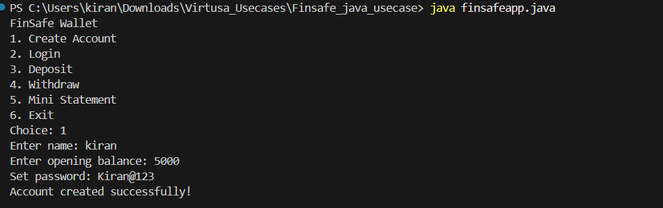
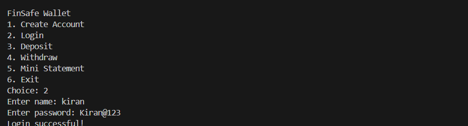
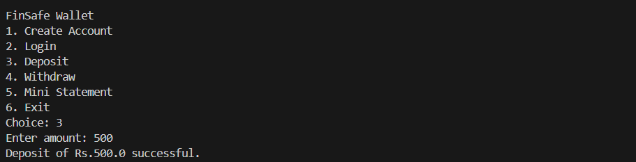
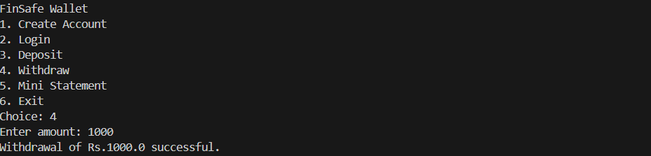
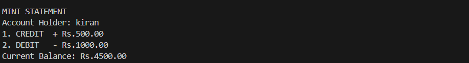

# FinSafe Wallet

A secure, console-based Java banking application that simulates real-world wallet operations — including account creation, authentication, deposits, withdrawals, and mini-statement generation.


## Overview

**FinSafe Wallet** is a lightweight Java console application that models the core functionalities of a digital wallet. It enforces secure password policies, tracks up to 5 recent transactions, and raises meaningful custom exceptions.

## Project Structure
- FinSafeApp.java
- Account.java
- InSufficientFundsException.java


## Features

-  Account creation with secure password validation
-  Login/authentication system
-  Deposit and withdrawal operations
-  Custom exception for insufficient funds (`InSufficientFundsException`)
-  Mini-statement showing last 5 transactions (CREDIT/DEBIT)
-  Real-time balance tracking


## Getting Started

### 1. Compile all Java files

```bash
javac *.java
```

### 2. Run the application

```bash
java FinSafeApp
```


## Usage

Once running, the application presents a menu-driven interface:

```
FinSafe Wallet
1. Create Account
2. Login
3. Deposit
4. Withdraw
5. Mini Statement
6. Exit
Choice:
```

Navigate by entering the number corresponding to the desired action.


## Class Reference

### FinSafeApp

The main class that handles user interaction.

* createAccount() – Creates a new account after validating input
* login() – Authenticates user credentials
* deposit() – Accepts amount and calls account deposit
* withdraw() – Accepts amount and performs withdrawal
* statement() – Displays mini statement
* isValidPassword(String) – Validates password rules
* main(String[]) – Runs the menu loop


### Account

Represents a wallet account.

* deposit(double) – Adds money and records transaction
* processTransaction(double) – Withdraws money and checks balance
* printMiniStatement() – Shows last 5 transactions
* recordTransaction(double) – Maintains transaction history
* getAccountHolder() – Returns account holder name
* getBalance() – Returns current balance
* getPassword() – Returns password


### InSufficientFundsException

Custom exception thrown when withdrawal exceeds balance.


## Exception Handling

* Withdrawal exceeds balance → InSufficientFundsException
* Invalid number input → handled using NumberFormatException
* Negative/zero amount → IllegalArgumentException
* Wrong login → shows error message


## Password Policy

Password must satisfy:

* Minimum 8 characters
* At least one uppercase letter
* At least one lowercase letter
* At least one digit
* At least one special character (@#$%^&+=!)

Example: Kiran@123

## Demo

### 1. Create Account

Enter your name, an opening balance, and a password that meets the security policy.




### 2. Login

Authenticate using your registered name and password.




### 3. Deposit

Add funds to your wallet after logging in.




### 4. Withdraw

Withdraw funds. The application prevents overdrafts via `InSufficientFundsException`.




### 5. Mini Statement

View a summary of your last 5 transactions along with the current balance.



