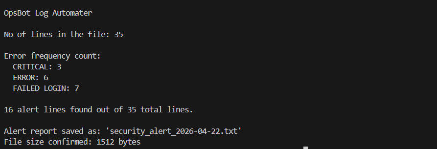
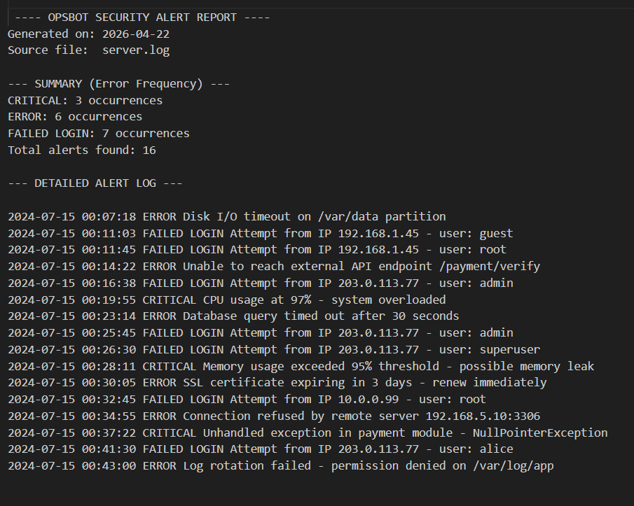

# OpsBot Log Automator

## Description

OpsBot Log Automator is a Python script that analyzes server log files, detects critical events using regular expressions, and generates a structured security alert report.

---

## Features

* Reads server log file
* Detects CRITICAL, ERROR, and FAILED LOGIN events
* Counts frequency of each error type
* Generates a daily alert report file
* Displays summary in console
* Calculates output file size

## Project Structure

* script.py
* opsbot.log
* security_alert_YYYY-MM-DD.txt

## How to Run

1. Make sure Python is installed

2. Place your log file as:
   server.log

3. Run the script:
   python opsbot.py

## Example Alerts Detected

* CRITICAL
* ERROR
* FAILED LOGIN

## Workflow

1. Reads the log file
2. Filters critical lines using regex
3. Counts occurrences of errors
4. Generates a report file
5. Displays summary in console

## Output

* A report file is generated:
  security_alert_YYYY-MM-DD.txt
  

* Report contains:

  * Error summary
  * Total alerts
  * Detailed alert logs
  

