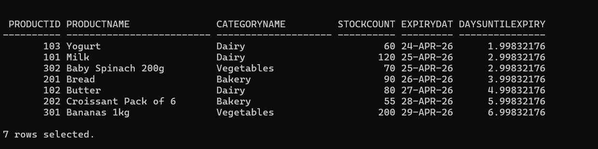
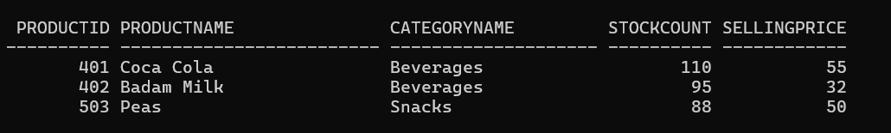
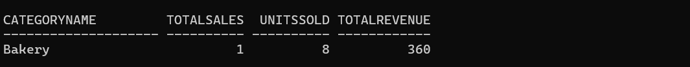

# FreshMart Stock Health Report

## Description

This project analyzes inventory and sales data for a retail store (FreshMart). It helps identify expiring products, dead stock, and revenue contribution by category using SQL queries.

## Features

* Inventory management using relational tables
* Detect products nearing expiry
* Identify dead stock (unsold products)
* Analyze revenue contribution by category
* Real-world retail analytics use case

## How to Run

1. Open any SQL tool
2. Run the script file
3. Execute queries one by one
4. View results for analysis

## Database Structure

### Tables:

* Categories – Stores product categories and departments
* Products – Stores product details, stock, pricing, expiry
* SalesTransactions – Stores sales records

## Key Queries

### 1. Expiring Products

Find products:

* Expiring within next 7 days
* Having stock > 50

Use case:
Avoid wastage and manage inventory efficiently

#### Output

### 2. Dead Stock Detection

Find products:

* Not sold in last 60 days
* Still having stock available

Use case:
Identify slow-moving or unsold inventory

#### output

### 3. Revenue Analysis

Calculate:

* Total sales transactions
* Units sold
* Total revenue per category

Use case:
Understand business performance by category

#### output

